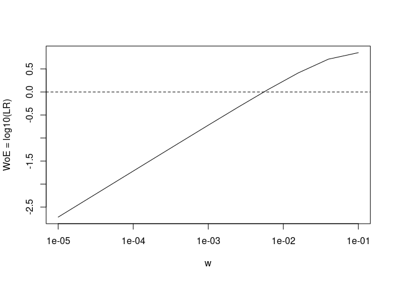

# `wgsLR`: Shotgun sequencing for human identification: Dynamic SNP marker sets and likelihood ratio calculations accounting for errors

Please refer to the online documentation at
<https://mikldk.github.io/wgsLR>, including the vignettes.

## Installation

To install from Github with vignettes run this command from within `R`
(please install `remotes` first if not already installed):

    # install.packages('remotes')
    remotes::install_github("mikldk/wgsLR", build_vignettes = TRUE)

You can also install the package without vignettes if needed as follows:

    remotes::install_github("mikldk/wgsLR")

## A few small examples

### Estimating the genotype error probability, $w$

``` r
cases <- wgsLR::sample_data_Hp(n = 1000, w = 0.1, p = c(0.25, 0.25, 0.5))
tab <- table(cases$X_D, cases$X_S)
tab
```

    ##    
    ##       0   1   2
    ##   0 251  52  15
    ##   1  77  97  80
    ##   2   9  86 333

``` r
w_mle <- wgsLR::estimate_w(tab)
w_mle
```

    ## [1] 0.1060797

### Calculating likelihood ratios ($LR$’s)

Assume that a trace sample had four loci with genotypes (0/1 = 1, 0/0 =
0, 1/1 = 2, 1/1 = 2). A person of interest is then typed for the same
four loci and has genotypes (0/0 = 0, 0/0 = 0, 1/1 = 2, 1/1 = 2), i.e. a
mismatch on the first locus.

For simplicity, assume that the genotype probabilites are P(0/0 = 0) =
0.25, P(0/1 = 1/0 = 1) = 0.25, and P(1/1 = 2) = 0.5.

If no errors are possible, then $w=0$ and

``` r
wgsLR::calc_LRs(xs = c(0, 0, 2, 2), 
                xd = c(1, 0, 2, 2), 
                w = 0, 
                p = c(0.25, 0.25, 0.5))
```

    ## [1] 0 4 2 2

and the product is 0 due to the mismatch at the first locus.

If instead we acknowledge that errors are possible, then for $w = 0.001$
we obtain that

``` r
LR_contribs <- wgsLR::calc_LRs(xs = c(0, 0, 2, 2), 
                               xd = c(1, 0, 2, 2), 
                               w = 0.001, 
                               p = c(0.25, 0.25, 0.5))
LR_contribs
```

    ## [1] 0.01192834 3.99199202 1.99799850 1.99799850

``` r
prod(LR_contribs)
```

    ## [1] 0.1900904

We can also consider the $LR$s for a range for plausible values of $w$:

``` r
ws <- 10^(-seq(5, 1, length.out = 11))
LRs <- sapply(ws, \(w) wgsLR::calc_LRs(xs = c(0, 0, 2, 2), 
                                       xd = c(1, 0, 2, 2), 
                                       w = w, 
                                       p = c(0.25, 0.25, 0.5)) |> 
                prod())
plot(ws, log10(LRs), type = "l", xlab = "w", ylab = "WoE = log10(LR)", log = "x")
abline(h = 0, lty = 2)
```

<!-- -->
